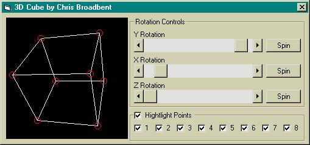



## A 3D Cube

### Description

A simple 3D test i made to help myself get of the ground in 3D, just has basic 3D algoritms.

the page i learnt this from is:

http://www.geocities.com/SiliconValley/2151/math3d.html

You just move the scrollbars of drag on picView to rotate the cube
 
### More Info
 
Couple scroll bars, draging

             |
---                |---
**Submitted On**   |2003-11-14 22:07:02
**By**             |[chris broadbent](https://github.com/Planet-Source-Code/PSCIndex/blob/master/ByAuthor/chris-broadbent.md)
**Level**          |Intermediate
**User Rating**    |5.0 (20 globes from 4 users)
**Compatibility**  |VB 6\.0
**Category**       |[Graphics](https://github.com/Planet-Source-Code/PSCIndex/blob/master/ByCategory/graphics__1-46.md)
**World**          |[Visual Basic](https://github.com/Planet-Source-Code/PSCIndex/blob/master/ByWorld/visual-basic.md)
**Archive File**   |[A\_3D\_Cube16720711142003\.zip](https://github.com/Planet-Source-Code/chris-broadbent-a-3d-cube__1-49911/archive/master.zip)

